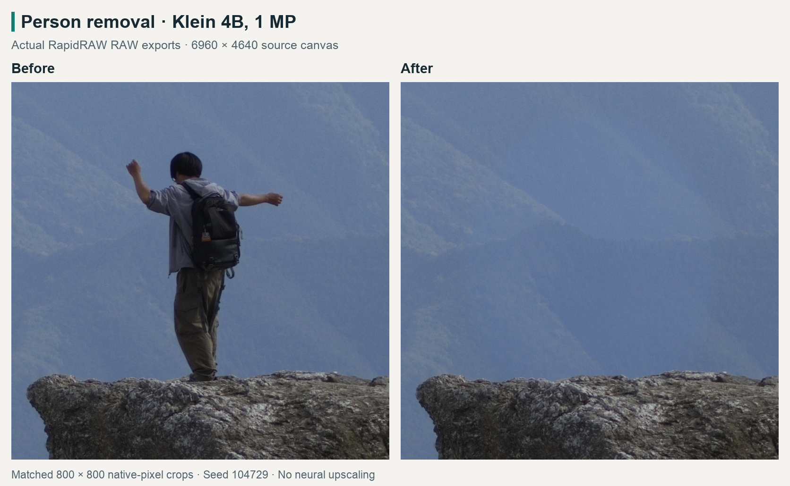
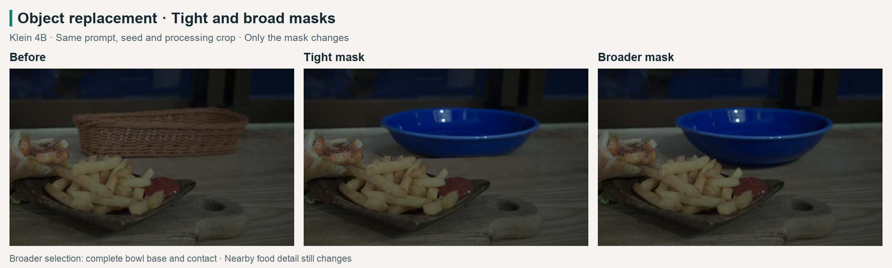
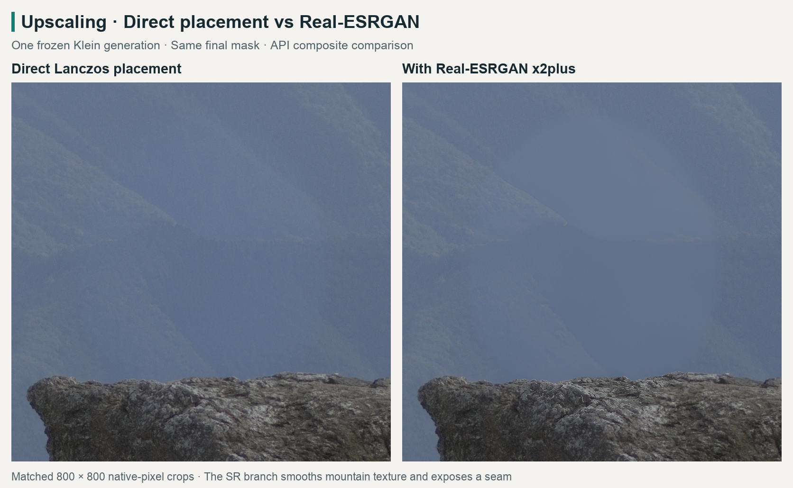

# RapidRAW AI editing test report

**13–14 September 2026.** We tested local inpainting workflows to choose a practical quality/speed balance for RapidRAW.

**Setup:** NVIDIA RTX 5060 Ti 16 GB, driver 595.58.03, PyTorch 2.12.0+cu130, ComfyUI 0.35.0 at c75d8c9, and a Linux RapidRAW build with MCP. Sources were 12.4–32.3 MP RAW photographs; models received sRGB JPEG conditioning images.

## What we tested

| Area             | Tests                                                                                                                                                                   |
| ---------------- | ----------------------------------------------------------------------------------------------------------------------------------------------------------------------- |
| Tasks            | Object removal and insertion, recolouring, lettering, replacement, clothing, backgrounds and weather                                                                    |
| Models           | Klein 4B / 9B KV, Boogu Edit / Turbo, FLUX Fill, Qwen Edit 2511 + Lightning, Z-Image Turbo + Fun, RealVisXL + Fooocus, Krea 2 AnyPaint, full-precision LaMa and Moebius |
| Workflow changes | Standard and closer context, masked and whole-context generation, tighter and broader masks, 1–2 MP generation and two 4 MP probes                                      |
| Upscaling        | NomosUni SPAN, Real-ESRGAN x2plus and NomosUni DAT on six frozen Klein results; SeedVR2 on three of those cases                                                         |

Controlled comparisons kept the source, prompt and seed fixed. Mask-size pairs also fixed the processing crop; upscaler tests reused the same generation and included Lanczos controls. We judged the requested change, preservation and native-size texture/boundaries.

## Results

- **Klein 4B was the most practical starting point.** The corrected-mask screen covered twelve tasks and three seeds: **5 Pass, 17 Conditional, 14 Fail**. Landscape person removal passed all three seeds. Larger or slower models did not provide a consistent quality upgrade across the compared cases.
- **Hard edits remained unreliable.** Eight complex tasks produced **51 trials / 48 unique composites**, using fourteen mask conditions and one seed. Agent review found **0 Pass, 23 Conditional, 28 Fail**. Conditional means useful but needing cleanup. Clothing could develop skin seams; background and weather edits could redraw faces, lettering or thin structures.
- **Broader masks helped complete shapes**, including bowl bases, motorcycle wheels and garment outlines, but allowed more surrounding content to change. Boogu Turbo followed the requested motorcycle direction where Klein failed; detail cleanup remained.
- **More pixels helped selectively.** Some 2 MP results improved fabric and landscape detail. The two 4 MP probes added no compelling advantage over 1 MP and took about 42 seconds each.
- **Upscaling did not earn a default extra stage.** SPAN gave one small improvement and one regression; Real-ESRGAN worsened integration in all six cases; DAT added substantial time without a new passing result. SeedVR2 introduced tone/detail artifacts; colour correction reduced tone drift but did not beat direct placement.

### Speed on this GPU

Median subsequent **Comfy graph execution** times from the complex screen, excluding cache completions, first observed calls, upload, native preparation, export and display. Case coverage differs between rows.

| Configuration                       |  Median | Samples |
| ----------------------------------- | ------: | ------: |
| Klein 4B FP8, 1 MP                  |  5.63 s |      13 |
| Klein 4B FP8, 2 MP                  | 14.64 s |       2 |
| Klein 9B KV FP8, 1 MP               |  7.68 s |       3 |
| Boogu Turbo INT8, 1 MP              | 11.84 s |       7 |
| Qwen Edit 2511 Q4 + Lightning, 1 MP | 29.29 s |       7 |

First observed Klein 9B and Boogu calls exceeded two minutes, making model switching a meaningful part of interactive cost.

## Representative comparisons

**Removal — actual RapidRAW export.** Klein removed the person with plausible mountain/rock continuity. Retouch took 8.21 s; the first native preview arrived after 9.52 s, excluding desktop display latency.

**Replacement — controlled API test.** Increasing selection coverage from 5.81% to 12.72% completed the bowl's base. Nearby food detail still changed.

**Upscaling — same frozen API generation.** Real-ESRGAN sharpened some edges but smoothed the mountain texture and exposed the repair boundary.

Five native complex-edit checks preserved all unselected export pixels. The bowl also passed undo, redo and save/reopen checks. A full RAW canvas is retained, but a 1 MP crop placed into a 32 MP export still contains 1 MP of generated content.

## Current conclusion

**Use Klein 4B at 1 MP first.** Fix mask coverage and prompt ambiguity before increasing cost. Compare 2 MP or closer context for a visible detail problem, and Klein 9B KV or Boogu Turbo for a specific instruction failure. Keep neural upscaling off by default and inspect the final patch at native size.

This small study has unequal model coverage and does not establish a general ranking. The bundled connector offers Klein 4B, closer-context Klein, Klein 9B KV and Boogu Turbo; other tested combinations remain research workflows.

[Selected model versions, checksums and detailed timings](assets/ai-editing-experiments/configurations.json) · [Using the included workflows](ai-editing-workflows.md)
